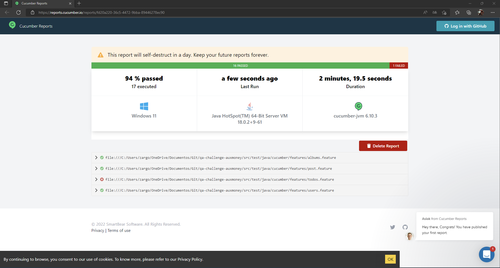

# [](https://skills.thijs.gg) qa-challenge-auxmoney 🚀

Qa challenge auxmoney is a project that was built to run 17 test case in the apk provided. 
Like a plus, was added the configuration to run the test cases in multiple devices, in the
evidence you will see the execution of couple of test cases in 2 devices.

## Getting Started 🔧
These instructions will get you to copy the project and running on your local machine.

### Prerequisites
You need to setUp some stuff before run the project.

- In case you are new to Java, you will need the [JDK](https://www.oracle.com/java/technologies/downloads/) and [JRE](https://docs.oracle.com/goldengate/1212/gg-winux/GDRAD/java.htm#BGBFJHAB)
- On Windows you will need to add the paths of the downloaded files and add the JAVA_HOME, JDK and JRE to the Path, My advice is to leave everything in C:/, in case you have downloaded/InstalledJava you should go to Program Files and find the paths there, so follow part of these [instructions](https://docs.oracle.com/en/database/oracle/machine-learning/oml4r/1.5.1/oread/creating-and-modifying-environment-variables-on-windows.html#GUID-DD6F9982-60D5-48F6-8270-A27EC53807D0)
- `node.js` You will need to install Node to follow the installation step by step since part of the necessary tools were installed through node [nodeJs](https://nodejs.org/en/download/)
- `Selenium` You will need the selenium server so that the development IDE can communicate with the emulated or physical devices [Selenium](https://www.selenium.dev/)
- `Appium` You need to install Appium server so that the development IDE can communicate with emulated or physical devices. [Appium server](https://appium.io/)
- `Appium-Doctor` Is a tool that allows us to analyze the configuration of the machine, and it will provide us with information about dependencies or pending things so that everything works correctly [Appium doctor](https://github.com/appium/appium-doctor)
- `Android Studio` You need to install Android Studio for device emulation [Android Studio](https://developer.android.com/)
- Once Android Studio is installed, it is necessary to add the SDK to the Path to avoid future problems. Usually located in C:\Users\AppData\Local\Android\Sdk. Add it as ANDROID_HOME
- `Intellij` I used IntellJ Idea to setUp the project [IntelliJ](https://www.jetbrains.com/es-es/idea/download/) - should be redirected to your corresponding operating system
- `Maven` You will need Maven to manage all the dependencies [Maven](https://maven.apache.org/download.cgi) - Once you are on the page, you must select "Source zip archive" and download the file in the case of Windows and leave it in a global path such as C:/ - Use this in case that you need it in other OS [Maven_OS](https://maven.apache.org/install.html)
- You need to install the Cucumber and Gherkin plugins for the .feature files to be recognized correctly [Install plugins](https://www.jetbrains.com/help/idea/managing-plugins.html)

### Installing 🔩
Please follow the next steps to execute the project successfully.
1. Open github desktop or the preferred terminal to clone the repository [GitHub Desktop](https://desktop.github.com/) - [GitHub Console](https://gist.github.com/derhuerst/1b15ff4652a867391f03)
2. Clone the repository locally in your machine
3. Open Intellij or your preferred IDE, and open the project that you already cloned. The tool will ask to install all Maven references. Please do it
4. Open a terminal of your choice and make sure you have node installed by running the following command: ```npm --version```, you should see the installed version
5. To install Appium run the following command: ```npm install -g appium```, -g Ensures that it is installed in all user directories
6. Run the ```appium --version``` command and it should display the installed version
7. To install Appium doctor run the following command: ```npm install appium-doctor -g``` and then ```appium-doctor --version``` and it should display the installed version
8. Now run the command ```appium-doctor --android``` to validate that everything is ready before continuing, if it shows any error please correct it before continuing
9. Now you need to open the Android Studio app and create the emulators. [Build emulators](https://developer.android.com/studio/run/managing-avds?hl=en-419)
10. Take into account that the name of the emulators will be parameterized in the testng.xml file, in effect of this execution please name them as: `emulator-5554` and `emulator 5556`, otherwise once you create them make sure to modify the names in the File

## Execution 🤖
1. Start the emulators in Android studio [Running Emulators](https://developer.android.com/studio/run/emulator)
2. Open the Appium application and run the server keeping in mind that in the Host field you must put: `localhost` and in the port: `4723` and then start the server
3. Since the project was created to run on different emulators, keep these recommendations in mind:
- In the `testng.xml` file you will find the parameterization of the names of the emulators and the threads that will be executed, if you change `thread-count="2"` by 1, if you have configured 2 devices the tests will only be executed in 1 device, so if you created 2 devices leave this field at 2
- Execute by right-clicking the `testng.xml` file and clicking the `Run '...\testng.xml'` option. This will run the entire test suite
- If you want to run a specific test case, you can make use of Cucumber's Tags feature by adding `@CucumberOptions` the tag you want to run and adding it to the feature you want to run with that tag. [Tags](https://cucumber.io/docs/cucumber/api/?lang=java#tags)

## Evidence 🎥 
- [One single device](https://drive.google.com/file/d/1GXaVuuiJqcNNZmmPgSo6dFOhozymDBrI/view?usp=sharing)
- [Two devices](https://drive.google.com/file/d/1Y65Tm14EnLMeXs3_MaqEysi9h8XMfo8a/view?usp=sharing)

### Report 📃
Once the execution is finished, in the terminal you will be able to find a link with the report of cucumber generated automatically. Should look like this: 

## Build With 🛠️
- [Appium](https://appium.io/)
- [Appium doctor](https://github.com/appium/appium-doctor)
- [Android Studio](https://developer.android.com/)
- [Appium inspector](https://developer.android.com/agi)
- [Java](https://www.java.com/es/)
- [nodeJs](https://nodejs.org/en/download/)
- [Maven](https://www.jetbrains.com/es-es/idea/)
- [Selenium](https://selenium.dev/)

## Authors ✒
* **Edwin Parra** - *Initial work* - [eyparra-qa](https://github.com/eyparra-qa)
* **Edwin Parra** - *Documentation* - [eyparra-qa](https://github.com/eyparra-qa)
